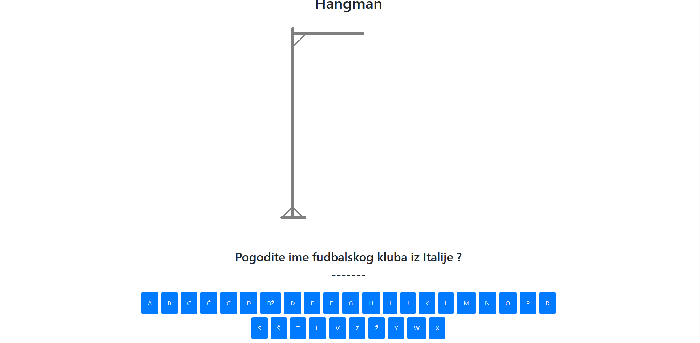
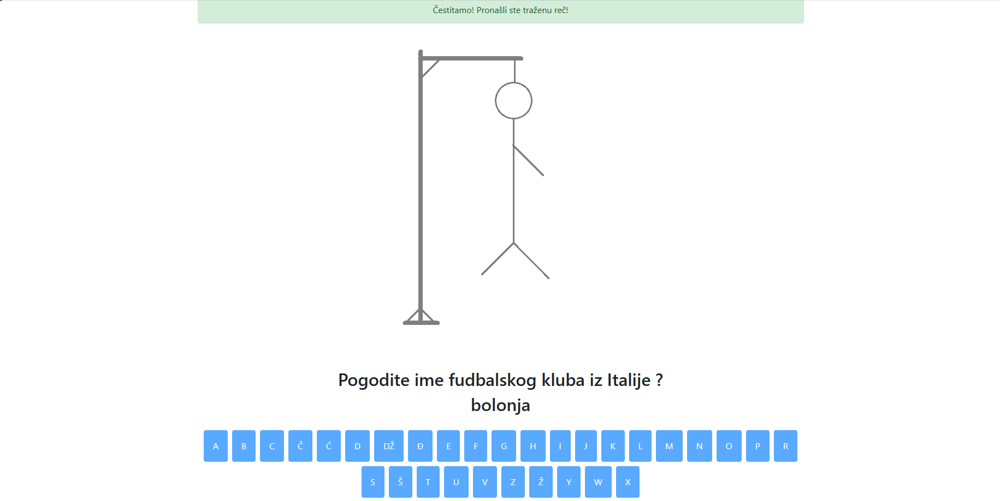

# hangman
Hangman Game

Description
Hangman is a classic word-guessing game where players attempt to guess a word, letter by letter, before running out of attempts. In each round, players guess a letter, and if the letter is in the word, it's revealed; otherwise, the player loses a chance. The objective is to guess the word before the "hangman" drawing is completed.

Technologies
The game is developed using:

HTML,
CSS,
JavaScript
 
Gameplay Rules :
A random word is selected as the secret word.
Players guess letters one by one.
Correctly guessed letters are revealed in the word.
Incorrect guesses result in losing a chance (represented by the hangman drawing).
The game continues until the word is guessed or the hangman drawing is completed.

Installation :
Clone this repository to your local machine using git clone.
Open the index.html file in a web browser.
How to Play
Start the game.
Enter a letter guess into the input field.
If the letter is in the word, it's revealed; otherwise, it counts as a wrong guess.
Continue guessing letters until the word is guessed or the hangman drawing is complete.
Win by guessing the word correctly within the given number of attempts.

Additional Features : 
You can enhance the Hangman game by adding features such as:
Difficulty levels
Time limits
Categories of words to guess (e.g., animals, countries, etc.)
Feel free to personalize the game with your unique twist or additional functionalities!
